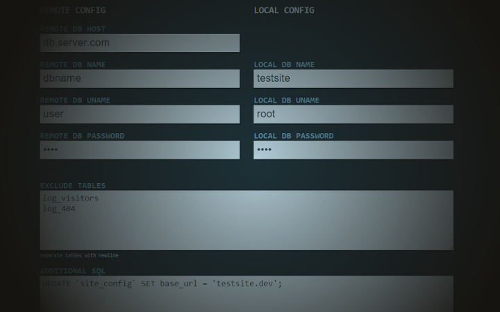

# The Magnificent Downstream Data Dumper

This is a utility to quickly and easily import data into your local VM's database from a remote server.

## Basic Usage
1. Access via port 9000. This vagrant machine is configured so that all traffic over port 9000 is routed to this application.
2. Configure your remote environment. The remote host, db name, user name, and password should match the credentials in your website's configuration for your production environment.
3. Configure your local environment. If you haven't changed any MySQL defaults you won't have to do anything here. By default the root username and password for scotchbox is set, and the db name will match the hostname you accessed the data manager from (this DB is created by the provisioning script when the machine is provisioned.)
4. Choose whether you want to import the dump now or save it for later, and click the big button.
5. Data only travels from the remote DB into the local db, so you don't have to worry about altering live data.

## Features
### Exclude Tables
Enter tables from the remote database to exclude from the dump file, separated by a newline.
### Additional SQL
Code entered here will be executed by a single `PDO::execute()` statement.
### Persistent configuration
Whether you choose to import, save the dump, or just save the configuration, the config is saved every time. 
It is saved in a json file in the `config` directory. Configurations are saved and loaded based on the hostname you 
accessed the data manager from. The intended way to use this is to add `:9000` to the URL you use to access 
your dev site in order to open the data manager with your site's configuration preloaded.
### Save it for later
There is an option to save the dump file without importing it. Files are saved in the `dump` directory. 
At the moment there is no way within the application to import a saved dump, and running it again will overwrite the existing dump file.

## Disclaimer
I built this to be fast and easy to use. Don't ever put this on a public server!